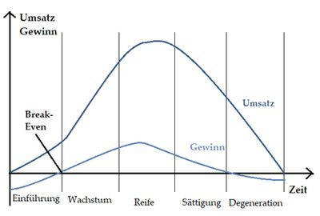
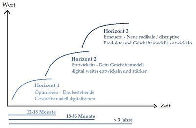

# Startups - Von der Produktidee bis hin zur Marktreife

## 1 Einleitung

Dieses Paper befasst sich mit der
Fragestellung, was ein Startup
Unternehmen machen muss, um sich auf
dem Markt zu etablieren. Außerdem stellt
es die Unterschiede bei der
Produkteinführung zwischen einem
bereits etablierten Unternehmen und
einem Startup dar. Es zielt darauf aus, was
nötig ist, um von einem Startup zu einem
erfolgreichen Unternehmen wachsen zu
können. In den folgenden Kapiteln wird
zunächst der Begriff Startup definiert,
woraufhin die größten Unterschiede
zwischen einem etablierten Unternehmen
und einem Startup erläutert werden. In
Kapitel 3 wird anschließend aufgezeigt,
wie die Unterschiede bei der
Produkteinführung aussehen und wie sich
Produkte auf dem Markt verhalten. Es
folgt ein Fazit, in welchem die vorab
gestellte Fragestellung beantwortet wird.

## 2 Ein Startup - was ist das?

Ein Startup ist in der Definition ein junges und
technologiebezogenes Unternehmen mit einer
innovativen Idee. Es hat sich noch nicht auf
dem Markt etablieren können, weshalb viele
Gründer auf der Suche nach Finanzierungsmöglichkeiten
sind, um schneller wachsen zu
können (Schnedler, 2018, S. 15-16).
Der Unterschied zwischen einem bereits auf
dem Markt etabliertem Unternehmen und
einem Startup besteht darin, dass bei einem
etablierten Unternehmen die Absatzwege
bereits klar definiert sind. Das Unternehmen
hat bestehende Beziehungen für den Absatz
und die zu erreichende Zielgruppe ist bereits
festgelegt, da ein bestehender Kundenstamm
vorhanden ist (Denkel, 2018, S.61). Ein auf dem
Markt etabliertes Unternehmen entwickelt
zudem meist mehrere Produktlinien, um
verschiedene Käufergruppen anzusprechen
und deren Kundenbedürfnisse abzudecken.
Beispielsweise bringt Apple nie nur ein IPhone
auf den Markt, sondern bietet mehrere
Produktlinien an, welche mit einem höheren
Preis ein größeres Ausstattungsniveau mit sich
bringen. Das Unternehmen kann so besser auf
die individuellen Kundenwünsche eingehen
und erreicht damit einen höheren Marktanteil
(Jacobsen, 2017, S. 143-145).
Ein Startup besitzt noch keine bestehende
Kundenbasis und muss seine Produkte so zum
Verkauf stellen, dass die potentiellen Käufer
überzeugt werden um die Produkte erwerben
zu wollen. Dabei besteht die erste Hürde darin,
genügend Kapital zur Produktion und für das
Marketing aufzubringen oder aber einen
geeigneten Investor zu finden (Denkel, 2018,
S.61). Um einen geeigneten Investor für sich zu
gewinnen, benötigt jedes Unternehmen einen
Businessplan mit den zu erwartenden
Absätzen für die nächsten Jahre und einen guten
Pitch seines Produktes (Denkel, 2018,S.65).
Die Höhle der Löwen, welche seit 2014 im
Fernsehen zu sehen ist, bietet jungen
Gründern diese Möglichkeit (Vieser, 2019, S.
42-43). Das Konzept der Show besteht darin,
dass Startups bzw. Unternehmensgründer bei
Investoren um Risikokapital zum Wachstum
ihres Unternehmens werben. Sie stellen ihre
Ideen und Konzepte den Investoren vor und
bieten ihnen einen Geschäftsanteil an, sollten
diese in ihre Startups investieren. Die
Kapitalgeber wiederum legen ihr privates
Vermögen in Unternehmen ihrer Wahl an und
begleiten diese anschließend mit Geld, Wissen
und Erfahrung. Sie tragen dazu bei, dass
Startups schnell wachsen können (Thelen,
2018, S.116-140).

## 3 Die Produkteinführung

Um überhaupt ein Startup gründen zu können,
wird zunächst eine Geschäftsidee benötigt,
welche eine Innovation mit sich bringt. Die
Geschäftsidee wird daraufhin von den
Gründern mithilfe eines Businessplans
festgehalten (Hahn, 1993, S. 773-796). Der
Businessplan definiert bereits in der frühen
Planung klare Vorstellungen des Gründers.
Hierin wird festgehalten, welche Ziele in
welchen Zeiträumen mit welchen
Maßnahmen und Mitteln zu erreichen sind
(Bhidé, 1999, S. 223-237). Allerdings wird ein
lange im Voraus geplanter Businessplan nicht
unbedingt benötigt um erfolgreich zu werden.
Denn bei dem Lean-Startup, was so viel wie
schlanker Startup bedeutet, liegt der Fokus
darauf, mit wenig vorab Planung und wenig
Kapital ein möglichst erfolgreiches
Unternehmen zu gründen. Der Grundgedanke
hierbei besagt, dass Learning-by-doing und
eine frühzeitige Marktetablierung erfolgsversprechender
ist als eine lange Vorabplanung
(Maier und Mies, 2019, S. 173-177).

Nach einer erfolgten Marktanalyse wird
bestimmt, welche Zielgruppe mit dem Produkt
erreicht werden soll, welche Eintrittsbarrieren
es zu beachten gilt und wie der eigene
Wettbewerbsvorteil auf dem Marktsegment
aussehen würde (Lodish, Morgen und
Kallianpur, 2001, S.4-10). Daraufhin wird das
Produkt zielgruppenentsprechend designt
und nach eingehender Analyse und Tests
verschiedener Produzenten letztendlich
produziert. Es folgt die Auswahl von
geeigneten Vertriebskanälen und die
eventuelle Vertragsabschließung mit Einzelhändlern,
welche die Produkte in Ihren
Geschäften ausstellen (Melles, 2017, S.45). Ein
zielgruppengerechtes Marketing ist dann der
letzte Punkt, den es zu verfolgen gilt (Bruhn,
2010, S. 33). Vielen Gründern fehlt es
letztendlich an genügend Kapital, um das
Unternehmen schnell wachsen zu lassen. Dies
lässt sich deutlich beschleunigen, indem Sie
einen Investor von Ihrer Geschäftsidee
überzeugen können. Sie erhalten gegen einen
Anteil am eigenen Unternehmen das
notwendige Kapital und begleiten den
Entrepreneur mit Wissen und Erfahrung. Die
Investoren haben bereits viele Beziehungen
und stehen mit ihrem eigenen Team dem
Gründer zur Verfügung. (Thelen, 2018, S.116-
140).
Mit der Markteinführung beginnt auch der
Produktlebenszyklus, welcher in der
Einführungsphase des Produktes startet. In
dieser ist noch unklar, wie das Produkt von
den Kunden aufgenommen wird. Die Länge
der Einführungsphase hängt dabei stark von
der Innovation des Produktes ab. Es lassen sich
zu Beginn nur geringe Umsätze erzielen,
welche allerdings hohen Kosten zur
Produktion, dem Vertrieb und Marketing
gegenüberstehen. Aus diesem Grund können
meist noch keine Gewinne realisiert werden,
bis der sogenannte Break-Even-Point erreicht
wird. Ab diesem Punkt deckt der Umsatz die
Kosten.
In der Wachstumsphase steigen die Umsätze
deutlich an, weshalb erstmals Gewinne erzielt
werden. Allerdings werden in dieser Phase
auch Konkurrenten angelockt. Deshalb sind
besondere Marketingmaßnahmen von Nöten.
In der Reifephase steigt der Umsatz weiter an,
allerdings ist der Gewinn rückläufig, da der
Wettbewerb immer weiter zunimmt. In dieser
Phase ist der Wettbewerb und die damit
verbundene Konkurrenz maximal. Darum
heißt es, seine eigenen Marktanteile zu
verteidigen. Durch Produktdifferenzierung
sollte sich im besten Fall von der Konkurrenz
abgehoben werden, da das Produkt
andernfalls schnell in die Sättigungsphase
gelangt.
In der Sättigungsphase ist der Markt von dem
Produkt vollständig gedeckt. Es gehen sowohl
Umsatz als auch Gewinn zurück, bis sie an die
Verlustschwelle stoßen.
Danach folgt die Degenerationsphase oder
auch Rückgangsphase, in welcher durch
weiter sinkende Umsätze aber steigender
Kosten Verluste eingefahren werden. In dieser
Phase des Modells muss entschieden werden,
ob das Produkt vom Markt genommen und
anstelle ein neues Nachfolgeprodukt etabliert
werden soll (Schawel und Billing, 2012, S. 207-
209).

**Abbildung 2: Der Produktlebenszyklus**

Quelle: Aumayr, 2016, S. 262.

Damit bereits ein Nachfolgeprodukt in den
Startlöchern steht sobald die Degenerationsphase
eintritt, gilt es für Unternehmen, das 3-
Horizont-Modell zu verfolgen.
Dabei wird in Horizont 1 die aktuelle
Geschäftslage gesteuert. Es werden Geschäfte
abgewickelt aber auch Innovationen getätigt,
um die Kundenbedürfnisse mit den
existierenden Produkten und Services zu
erfüllen. Die Innovationen aus dem Horizont 1
haben viel mit Effizienz- und Qualitätssteigerung
zu tun.
Wenn ein Unternehmen allerdings wachsen
will, sollte Horizont 2 verfolgt werden. Hier
werden Innovationen entwickelt, die über die
des Horizonts 1 hinausgehen und diesen später
entweder erweitern oder ganz ersetzen. Im
Normalfall dauert es ein bis zwei Jahre, bis das
Produkt in Horizont 2 einsatzbereit ist. Um ein
nahtloses Wachstum für das Unternehmen zu
ermöglichen, sollte also mit der Entwicklung
eines neuen Produktes in Horizont 2 ein bis
zwei Jahre vor dem stagnieren des aktuellen
Wachstums begonnen werden.
In Horizont 3 werden Entwicklung in 18 bis 36
Monaten in der Zukunft produziert und viele
Ideen parallel bearbeitet. Es geht darum, mit
wenig Aufwand und geringen Kosten viele
Optionen für die Zukunft zu sichern. Damit
soll eine zukünftige Marktentwicklung
gesichert werden (Kreutzer, 2018, S.81-84).

**Abbildung 3: Das 3-Horizont-Modell**

Quelle: Kreutzer, 2018, S.81-84.

## 4 Fazit

Abschließend ist zu sagen, dass ein Startup
einen langen Weg vor sich hat, bis es im
Markt etabliert ist. Der Grad der Innovation
erhöht die Absatzchancen sowie den
Produkt- und Unternehmenserfolg.
Allerdings muss ein Startup, anders als ein
bereits etabliertes Unternehmen, bei der
Einführung zunächst gegen viele
Markteintrittsbarrieren kämpfen. Ein
bereits etabliertes Unternehmen hat feste
Vertriebspartner, festgelegte Absatzwege
und einen Kundenstamm. Für ein Startup
wiederum ist eine gute Marketingstrategie
das A und O, damit potentielle Kunden
überhaupt auf die Marke und das Produkt
aufmerksam werden. Da hierfür viel Kapital
benötigt wird und es vielen Startups daran
mangelt, ist die wohl einfachste Lösung zur
Marktetablierung die Investition durch
einen Investor, welcher durch seine
Bekanntheit und Beziehungen die Produkte
besser vermarkten kann als es jede
Marketingstrategie könnte.
Das Erfolgsrezept für ein erfolgreiches
Startup ist somit der Grad der Innovation
des Produktes und die vorhandenen
Beziehungen, welche die Etablierung auf
dem Markt zunehmend erleichtern.

## 5 Literaturverzeichnis

**Aumayr**, K. (2016). Erfolgreiches
Produktmanagement. Tool-Box für das
professionelle Produktmanagement und
Produktmarketing. Wiesbaden: Springer
Gabler.

**Bhidé**, A. (1999). Bootstrap Finance. The art of
start-ups. In Sahlman et al. (Hrsg.). The
entrepreneurial venture (S. 223-237). Boston:
Harvard School Press.

**Bruhn**, M. (2010). Grundlagen für Studium
und Praxis. Wiesbaden: Springer Verlag.

**Denkel**, A. (2018). Innovativer Unternehmer
versus Startup-Gründer. Unterschiede und
Gemeinsamkeiten. Wiesbaden: Springer
Gabler.

**Hahn**, D. (1993). Planung in der
Unternehmenspraxis. In J. Hauschildt, O.
Grün (Hrsg.), Ergebnisse empirischer
betriebswirtschaftlicher Forschung. Zu einer
Realtheorie der Unternehmen (S.773-796).
Stuttgart: Schäffer-Poeschel Verlag.

**Jacobsen**, N. (2017). Das Apple-Imperium 2.0.
Die neuen Herausforderungen des
wertvollsten Konzerns der Welt (2. Auflage).
Wiesbaden: Springer Fachmedien Wiesbaden.

**Kreutzer**, R. T. (2018). Toolbox für Marketing
und Management. Kreativkonzepte –
Analysewerkzeuge – Prognoseinstrumente.
Wiesbaden: Springer-Verlag.

**Lodish**, L., Morgen, H. und Kallianpur, A.
(2001). Entrepreneurial Marketing. Kanada:
John Wiley & Sons.

[**Maier**, R., R. und Mies, R. (2019).](1.pdf) Entwicklung eines Anlaufmodells für das Lean Start-up. ZWF Zeitschrift für wirtschaftlichen Fabrikbetrieb. 2019 (4), 173- 177, DOI: ZWF_20190429_173_01_04.
Melles, A. (2017). Produkteinführung. Wiesbaden: Springer-Verlag GmbH.

**Schawel**, C. und Billing, F. (2012). Top 100
Management Tools. Das wichtigste Buch eines
Managers Von ABC-Analyse bis
Zielvereinbarung. Wiesbaden: Gabler Verlag.

**Schnedler**, J. (2018). Startup-Recht.
Praktischer Leitfaden für Gründung,
Unternehmensführung und -finanzierung.
Heidelberg: O’Reillys.

**Thelen**, F. (2018). Die Autobiografie. Startup-
DNA - Hinfallen, aufstehen, die Welt
verändern. Hamburg: Murmann Publishers
GmbH.

[**Vieser**, S. (2019).](2.pdf) Möge die Show beginnen. HORIZONTmagazin. 2019 (15), 42-43, DOI: 20190411492632.

Verwendete Bilder dieser Arbeit von
[unsplash](https://unsplash.com/)
